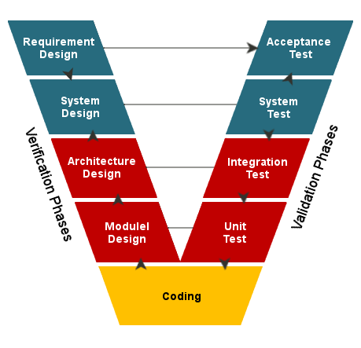

|  **Version**  |  **Published**  |  **Changed By**  |  **Comment**  | 
|  --- |  --- |  --- |  --- | 
| v1 | 31/08/22 | Keigo Nagai | Created rough draft of testing plan for the project. | 
|  |  |  |  | 

### Terminology

|  **Term**  |  **Definition**  | 
|  --- |  --- | 
|  **Test suite**  | a set of test cases | 
|  **Test case**  | a set of inputs, execution conditionals, and a pass/fail criterion | 
|  **Test** or  **test execution**  |  the activity of executing test cases and evaluating their results | 
|  **Adequacy criterion**  | a predicate that is true (satisfied) or false (not satisfied) of a (program, test suite) pair | 

## Why Testing?
A process to identify the correctness, completeness and quality of developed computer software, 

which includes a set of activities conducted with the intent of finding errors in software so that it 

could be corrected before the product is released to the end users.

From Week 6 lecture slides - Software Testing.

## Scope

|  **In Scope**  |  **Out of Scope**  | 
|  --- |  --- | 
| <ul><li>Unit Testing

</li><li>Integration Testing

</li><li>System Testing

</li><li>Acceptance Testing

</li><li>User-based UX Testing

</li></ul> | <ul><li>Cross-platform testing

</li><li>Cross-browser Testing

</li></ul> | 

|  |  | 
|  --- |  --- | 
|  **Who**  | For every ticket assigned on JIRA, it is the assigned coders responsibility to write tests for the functionality of the ticket, or to delegate the task of testing the functionality to another teammate. | 
|  **When**  | Ensure tests and testing occurs within sprints of the ticket. (In parallel to agile sprints). If in any case that a test case is thought not to be required, an adequate reasoning shall be documented/reported. | 
|  **How**  | Each ticket ID (UC\[n]) should have an acceptance ID (AC\[n]), corresponding to a user story. Along with a testing scheme with a test ID (TC\[n]) corresponding to the acceptance ID. An example of how to document a test case is shown below. | 

## Documenting Test Cases (Example)
[[Documented page|Test-suite]]

|  **TC-ID**  |  **Test Case**  |  **Test Steps**  |  **Test Data**  |  **Expected Result**  |  **Test Type**  |  **Configuration**  |  **Passed**  | 
|  --- |  --- |  --- |  --- |  --- |  --- |  --- |  --- | 
| 1 | Verify login | 
1. Go to login page

1. Enter email address

1. Enter password

1. Click Login

 | emailAddress = “abc@mail.com”password = “password” | Login successful, takes user to home page. | <ul><li>Manual

</li><li>Integration Testing

</li></ul> | NA (Manual) | Successful | 
| Test ID corresponds to the User Story ID | Brief explanation of the test case and what is being tested. | Clear and concise steps taken to execute the test case. | The sample test data used in the test case. | The expected result | List the characteristics of testing, e.g. manual or automated, unit or integrated testing etc. | If an automated testing is implemented, note frameworks used and test code file path. Otherwise, any extra comments worthwhile noting. | Result of the test case. | 

## What to achieve through testing

* Consider seven principles

    * Exhaustive testing is not possible

    * Defect clustering - a small number of modules contain most of the defects detected.

    * Pesticide paradox - Test cases need to be regularly reviewed and revised, adding new and different test cases to help find more defects

    * Testing shows a presence of defects

    * Absence of error is a fallacy - bug-free system is useless if it does not fulfill users needs and requirements

    * Early testing - much cheaper

    * Testing is context-dependent

    

## V-model

## Stages of Testing (+ frameworks used)

### Unit Testing
Priority: High

Test single functions individually and independently for proper operation.

* Write tests per task assigned per sprint of the project

* Jest/Cypress (can use cypress to keep stack small and simple)

### Integration Testing
Ensure that the individual modules and function work together in harmony.

* Postman to test APIs

### System Testing (End-to-end)
Using a user-like robot to test the functionality of the website.

* NextJS with Cypress

* Should be closely linked to user stories and acceptance criteria

### Acceptance Testing
Functional and non-functional testing to verify whether business requirements are met and if product is ready to be delivered for its users.

* Similar aspects to System testing where functional tests are run to meet client’s requirements and “must-have” and “should-have” user stories

* Feedback from Client as well as other test-users

## Functional Testing (Black-box testing)

* Deriving test cases from program specifications

* Not concerned about source code of the application

* Linked heavily to user stories and requirements

Each user story should be tied to an acceptance criteria, which should be tested to pass both the functional test, as well as the acceptance criteria.

## Non-functional Testing
The user experience/usability and performance of the application should be tested.

### User Experience (UX)
"how people feel about a product and their pleasure and satisfaction 

when using it, looking at it, holding it, and opening or closing it. It includes their 

overall impression of how good it is to use, right down to the sensual effect small 

details have". (Preece et al., 2015, p. 12)

### Heuristic Evaluation

1. Visibility of System Status

1. Match between System and the Real World

1. User control and Freedom

1. Consistency and Standards

1. Error Prevention

1. Recognition rather than recall

1. Flexibility and Efficiency of Use

1. Aesthetic and Minimalist Design

1. Help Users Recognize, Diagnose, and Recover from Errors

1. Help and Documentation

### User-based UX Testing

* Invite client to interact with demo

### Load Testing

* How well application can withstand large amount of data/multiple users using app/server simultaneously

* Type of performance testing, determining performance of program. Not functional correctness of program

## Acceptance Criteria

* see [[Acceptance criteria|Acceptance-criteria]]

*****

[[category.storage-team]] 
[[category.confluence]] 
